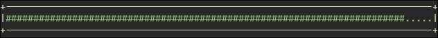

# <ins>GA documentation</ins>

# <ins>Table of contents</ins>
- [Description](#description)
- [Set up](#set-up)
- [Instantiation](#instantiation)
- [Processing data](#how-to-process-data)
- [Fitness function](#fitness-function)
- [Graphs](#graphs)
- [Reading and Writing to a file](#saving)
- [Debugging / getters](#debugging-and-getters)
- [Optimisation](#ga-optimisation)
- [Extra](#extra)

## <ins>Description</ins>

|Key words| Meaning|
|---------|--------|
|GA| Genetic algorithm, what this whole project is|
|Gene| Literally just a character stored in a DNA strand|
|DNA| A list of Genes. Also a data type in this project|

```
["A","B","C","D"] <- DNA strand
  ^
  |
 Gene
```
A GA (or genetic algorithm) is an algorithm that tries to optimise the solution to a problem or work it out. 

It starts off with a first generation where each DNA is made out of random genes that are within the character set you will provide.

It does this by feeding each DNA strand of the first generation into a fitness function to test how well it has performed. It will then take the best performing DNA strands and create a whole new generation by splitting these DNA strands and reconnecting them together to form a new DNA strand

e.g:
```
[A,B,C,D]  -> [A,B] [C,D] \
                           -----> [A,B,G,H] [E,F,C,D]
[E,F,G,H]  -> [E,F] [G,H] /
```

It will then apply the mutation rate. This means it goes through each gene and will choose (based on RNG) if the gene will change / mutate to a random character in the given character set.

It will then feed this new generation back into the GA and repeat the whole process until it figures it's target out or until you stop it.

This project is my attempt at creating this algorithm / AI.

It works of two main classes being used. Those being the GA class and DNA class.
## <ins>Set up</ins>

Download the two .hpp files needed (GA.hpp, DNA.hpp)

### Arch Linux

`sudo cp GA.hpp /usr/local/include/`

and 

`sudo cp DNA.hpp /usr/local/include/`

to make them global libraries so you don't have to be worried about where they are stored

### Windows

Place both .hpp files into 

`C:\Program Files\mingw64\include\`

### Universal

Place both .hpp files into the same directory as your main code

### In .cpp file
Use the `#include <GA.hpp>` header.

The GA.hpp file already references DNA.hpp

No extra lines of compilation are required

## <ins>Instantiation</ins>

In order to create the GA object you need to write:

```cpp
GA gaName(100, 5, 0.03, 0.4, "SaveLocation.txt", characterSet, 1);
```
|Parameter name|Parameter|Description|Data type|
|--------------|---------|-----------|---------|
|No. DNA|100| How many DNA strands you want to be working with| int|
|DNA lenght|5| How many characters the DNA will have| int|
|Mutation rate|0.03| The chance that any gene in the DNA will change to a random character within the character set| float |
|Crossover rate|0.4| The chance that the crossover will actuall result in change| float |
|Save location |"SaveLocation.txt"| Enter the address of where you want the save data to be written to| std::string|
|Character set| characterSet| A list of all the characters the GA may use as it's learning| std::vector\<std::string\>|
|Graph theme|1| Select the characters that will be used to represent the graphs|int|

## <ins>How to process data</ins>

### GA class
| Function | Description|Parameters| Parameter data types|
|----------|------------|----------|---------------------|
|initRNG()|It will set up RNG working for the whole file. Place it in the `int main()` before the instantiation. Only needs to be written once, even if you have multiple GAs running. This isn't part of the GA class and can be run without reference to it|- |- 
|_.makeFirstGen()|This will create a generation out of random genes (from the character set). This should be run once, straight after the GA instantiation|- |- 
|_.setFitnesses()|This will set the all the fitnesses in the GA to the given list. Should have gone through the fitness function before this|listOfFitnesses|std::vector\<float> 
|_.sortFitnesses()|This will sort the fitnesses and DNA strands into best performing to worst performing (using quick sort)|- |- 
|_.crossover()|This will select how many of the best performing DNA will be chosen to make the next generation and how many pieces the DNA will be split up into|numOfSections, topGenes|int, int
|_.applyMutation()|This will apply the mutation rate to the newly created generation|- |- 

These are the basic instructions needed to get the GA working.

An example of this would be:
```cpp
    int main(){
        initRNG();

        GA ga(100,target.size(),0.03,fileName, charBounds, 2);
        ga.makeFirstGen();

        while(true){
            ga.setFitness(listOfFitnesses);
            ga.sortFitness();
            //Will take the top 20 DNA and split them into 4 pieces
            ga.crossover(4, 20);
            ga.applyMutation();
        }
    }
```

The main part that is now missing is the fitness function

### DNA class

| Function | Description | Parameters | Parameter data type | Return Data types|
|----------|-------------|------------|---------------------|------------------|
|_.getValueAt()| Will return the value at the inputted location| index | int | std::string|

## <ins>Fitness function</ins>

The fitness function is unique for each task and will have to be written based on what you are trying to solve.

To solve this problem, I have tried making the fitness function as uncomplicated for me and for you by having you write it and be able to get the DNA list easily.

The command `_.getDNAList()` will return an `std::vector<DNA>`. This should be put in to a self made function that will return an `std::vector<float>` that can be used as the parameter for the previously mentioned `_.setFitnesses` command.

Also use the `_.getValueAt()` function in the DNA to get the individual genes.

Here's an example of how I would expect it to be done:

```cpp
std::vector<float> fitnessFunction(std::vector<DNA> allDNA, std::string target){
    std::string goal = target;
    std::vector<float> allFitness;

    for(auto& DNA : allDNA){
        float correct = 0;
        for(int i = 0; i < goal.length(); i++){
            if(DNA.getValueAt(i) == std::string(1,goal[i])){correct++;}
        }
        float percent = correct / goal.length();
        allFitness.push_back(percent);
    }
    return allFitness;
}

int main(){
    std::vector<float> fitnesses = fitnessFunction(ga.getDNAList(), target)
    return 0;
}
```
*this example is missing the fitness function*

## <ins>Graphs</ins>

This library has inbuilt graphing functions and different themes for them too. 

The graphs are printed using [ANSI escape sequences](https://en.wikipedia.org/wiki/ANSI_escape_code) which is a native function to most computers allowing to print in different colours and at a specific location. My print functions don't have a 'clear screen' function since ever character is written over anyway.

Currently, the only graphs it can produce are bar graphs that show the fitness of the current generation.

|Function| Description |Parameters|Parameter data types|
|--------|-------------|----------|--------------------|
|_.initScreen()|This will get the size of the terminal the GA is being run in and defines how many bars will be drawn and their size|- |-
|_.barGraph()|This will actually draw the bars and a big bar at the bottom showing the average fitness of the last (inputted value) generations|numOfGenerations|int
|_.showInfo()|Will show details about the GA in the top tight corner of the screen. It's height is set but you need to define it's width|widthOfWindow|int
|_.printBuffer()| This will print everything and clear the buffer|- |-

### Theme 1


### Theme 2


### Theme 3


### Theme 4

                                                                                                                                                                                 
## <ins>Saving</ins>

The GA is able to save the progress it has done. It does this by saving the current generationa and saving it to a text file.

|Function|Descrioption|Parameters|Paramater data types|
|--------|------------|----------|--------------------|
|_.saveGen()|Will save the current generation into the inputted file name. Will create the file if it doesn't exist|- |-
|_.loadGen()|Will load from the save file and put directly into the GAs first generation (replaces _.makeFirstGen()|- |-

Make sure to not edit the text file once it has been created otherwise it won't be readable.

## <ins> Debugging and Getters </ins>

In the case you are using the GA with a program that locks you out of the terminal or you need to find som errors in the code, I have implemented a few getters to help with that.

|Function|Description|Return data type|
|--------|-----------|----------------|
|.getNumOfDNA()|This will return the number of DNA that exist in the GA|int|
|.getDNALength()|This will return the number of genes in each DNA strand|int|
|.getMutationRate()|This will return the current mutation rate|float|
|.getSaveLocation()|This will return the file name where the saves will be made|std::string|
|.getCorrectGuessGen()|This will return the generation where the first successful attempt was made|int|
|.getBestGuess()|This will return the best guess of each generation|std::string|
|.getGenNumber()|This will return the current generation number|int|
|.getBestFitness()|This will return the best fitness accieved each generation|float|
|.getCrossoverRate()|This will return the current crossover rate|float|
|.getFitnesses()|This will return all the fitnesses in the GA|std::vector<float>|

## <ins>GA optimisation</ins>

There are a few tips I can give to help optimise your GA.

1) Set the ```topGenes``` parameter in the ```.crossover()``` function to 10% - 30%
2) ```mutationRate``` when instantiating should be between 0.5% - 5.0%
3) Keep the ```crossoverRate``` in the ```.crossover()``` function to 60% - 95%
4) Have your ```population``` during instantiation to 50 - 200 DNA strands


## <ins>Extra</ins>

Here's the whole example for the word guesser. You may use it to see what a finished project should look like: 

```cpp
#include "GA.hpp"

//Creates the character set
std::vector<std::string> createBounds(){
    std::vector<std::string> tempList;
    for(int i = 36; i < 127; i++){
        char chr = char(i);
        tempList.push_back(std::string(1,chr));
    }
    tempList.push_back(" ");
    return tempList;
}

//Fitness function for this example
std::vector<float> fitnessFunction(std::vector<DNA> allDNA, std::string target){
    std::string goal = target;
    std::vector<float> allFitness;

    for(auto& DNA : allDNA){
        float correct = 0;
        for(int i = 0; i < goal.length(); i++){
            if(DNA.getValueAt(i) == std::string(1,goal[i])){correct++;}
        }
        float percent = correct / goal.length();
        allFitness.push_back(percent);
    }
    return allFitness;
}

std::string fileName = "wordGuessSave.txt";
std::string target = "dkafgow g8ooq3g ro4qg2igr 892y3pq 34rqg ' '    arq k 9 23";

int main(){
    initRNG();

    std::vector<std::string> charBounds = createBounds();
    GA ga(100,target.size(),0.03,fileName, charBounds, 1);
    ga.makeFirstGen();
    int i = 0;
    while(true){
        ga.setFitness(fitnessFunction(ga.getDNAList(), target));
        ga.sortFitness();
        ga.crossover(4, 20);
        ga.applyMutation();
        i++;
        if(i % 1 == 0){
            ga.barGraph(10);
            ga.showInfo(target.size());
            ga.saveGen();
            ga.printBuffer();
            if(ga.hasGotten()){
                ga.pause();
            }
        }
    }
    return 0;
}

```
